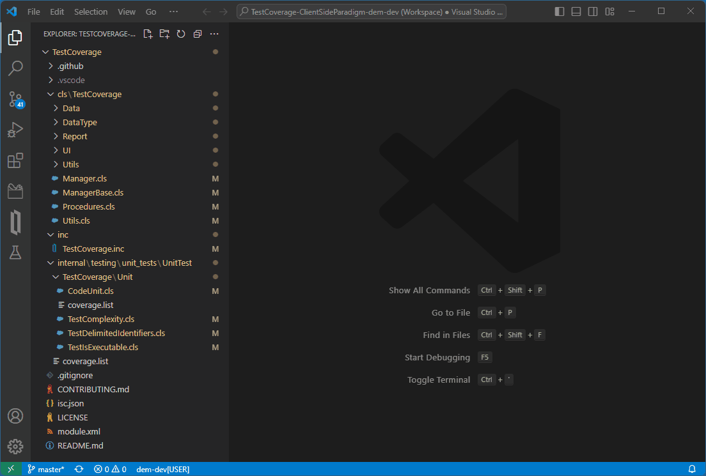

# InterSystems Testing Manager

This extension uses VS Code's [Testing API](https://code.visualstudio.com/api/extension-guides/testing) to discover, run and debug unit test classes built with the [%UnitTest testing framework](https://docs.intersystems.com/irislatest/csp/docbook/DocBook.UI.Page.cls?KEY=TUNT_WhatIsPercentUnitTest) of the InterSystems IRIS platforms, plus Cach&eacute;-based predecessors supporting the `/api/atelier` REST service.

It augments the ObjectScript, InterSystems Language Server and Server Manager extensions, which are elements of the [InterSystems ObjectScript Extension Pack](https://marketplace.visualstudio.com/items?itemName=intersystems-community.objectscript-pack).

Classes extending `%UnitTest.TestCase` are shown in the Test Explorer view, from where they can be run and any failures investigated. An additional folder in Test Explorer gives easy access to the results of recent test runs on the server.

InterSystems Testing Manager works with both of the source code location paradigms supported by the ObjectScript extension. Your unit test classes can either be mastered in VS Code's local filesystem (the 'client-side editing' paradigm) or in a server namespace (the ['server-side editing'](https://intersystems-community.github.io/vscode-objectscript/serverside) paradigm). In both cases the actual test runs occur in a server namespace.



_Client-side editing workspace_


_Server-side editing workspace_

In order to support topologies in which client-side-managed test classes have to be run in the namespace of a remote server, this extension uses the `/_vscode` web application on the test-running server, no matter whether local or remote.

## Server Preparations

1. Using the server's **Management Portal**, go to **System Administration > Security > Applications > Web Applications** and look for an application named `/_vscode`.

    - If it doesn't exist, follow [these instructions](https://intersystems-community.github.io/vscode-objectscript/serverside/#configuring-storage-for-folder-specific-settings) to create it. Make a note of the **Physical Path** value you entered. The convention suggested in the linked instructions is to use a `.vscode` subfolder of the server's install folder, for example `C:\InterSystems\IRIS\.vscode` on Windows.

    - If the web application already exists, note its **Physical Path**.

2. Using an IRIS terminal session on the server, set the `^UnitTestRoot` global in each namespace you will run unit tests in via the extension. Start with the path string noted in the previous step, appending two subfolders to it. The first must match the uppercase namespace name and the second must be `UnitTestRoot`. For example, in the USER namespace of a default Windows install of IRIS:
    ```
    USER>set ^UnitTestRoot="C:\InterSystems\IRIS\.vscode\USER\UnitTestRoot"
    ```
> If you previously used the `%UnitTest` framework in a namespace, be aware that you are probably replacing an existing value. Consider taking a note of that in case you need to revert.

## Workspace Preparations

1. Ensure your VS Code workspace specifies its server connection(s) by referencing server(s) in the `intersystems.servers` configuration object which InterSystems Server Manager maintains. For example, assuming a server named `iris231` has been defined:

    - For the client-side paradigm (in `settings.json`, or in `"settings"` object in `xxx.code-workspace` file):
    ```
    "objectscript.conn": {
        "server": "iris231",
        "ns": "APP",
        "active": true
	},
    ```
  
    - For the server-side paradigm (in `xxx.code-workspace` file):
    ```
    "folders": [
		{
			"name": "iris231:APP-ISFS",
			"uri": "isfs://iris231:app-isfs/?mapped=0"
		}
	],
    ```

> We recommend setting the `username` property of the server definition object, and using Server Manager's secure password storage feature to hold that user's password.

2. For a workspace using client-side editing, test classes are sought in `.cls` files under the `internal/testing/unit_tests` subfolder, using the conventional layout of one additional subfolder per package-name element. If your test classes are located elsewhere, use the `intersystems.testingManager.client.relativeTestRoot` setting to point there.

> By setting this at the workspace level you can have different file layouts for different projects.

## Running Tests

VS Code provides several different ways to run tests.

In the Test Explorer view expand the first root folder, which is captioned 'Local Tests' or 'Server Tests' depending on which paradigm your workspace uses.

A subfolder displays for each root folder of your workspace, which may be a multi-root one. Within this you are shown the test classes. The 'Local Tests' tree uses a heirarchical structure with one subfilder per segment of the package name. The 'Server Tests' tree uses a flat structure.

At the level of an individual test class the final expansion shows a leaf for each `TestXXX` method.

Hovering over any level of a tests tree will reveal action buttons that run all the tests from this level down. The 'Run' button does so without stopping at any breakpoints, in contrast to the 'Debug' button. At class or method level a 'Go to Test' button opens the class code and positions the cursor appropriately. At higher levels this button navigates to Explorer View.

When a test class is open in an editor tab it displays icons in the gutter at the top of the class and at the start of each test method. These show the outcome of the most recent run, if any, and can be clicked to perform testing operations.

The `...` menu of the Testing panel in Test Explorer includes several useful commands, including ones to collapse the tree and to clear all locally-stored test results.

## Recent History

The %UnitTest framework persists results of runs in server-side tables. The 'Recent History' root folder lets you explore the most recent ten sets of results for each server and namespace the workspace uses.

Hovering on a run's folder reveals an action button which launches %UnitTest's own results browser in an external web browser.
