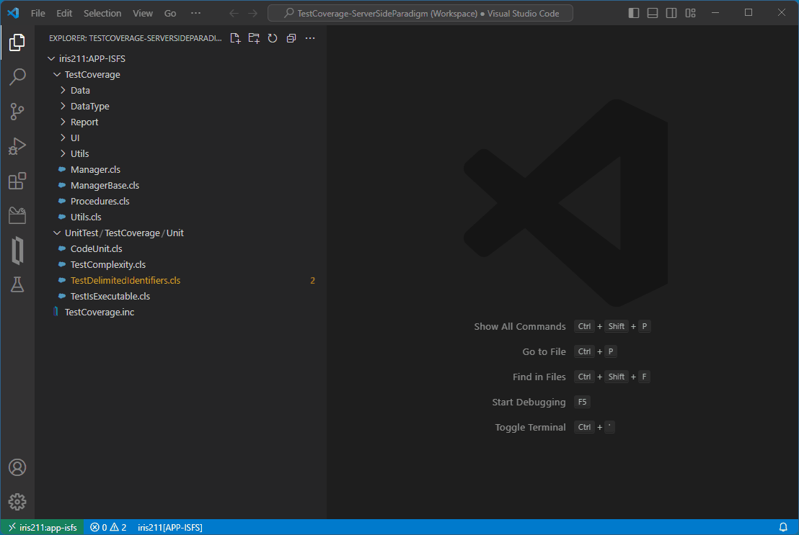
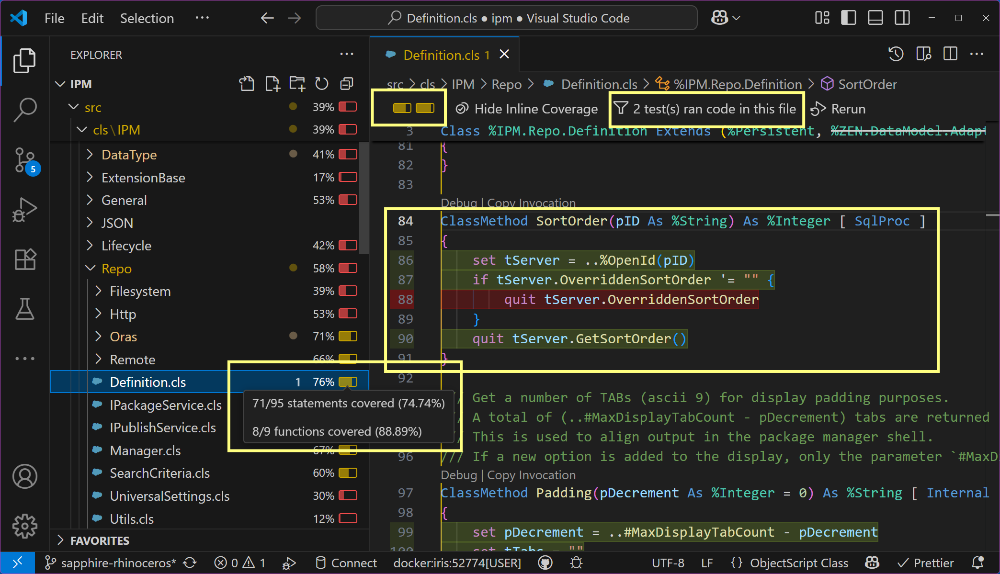

# InterSystems Testing Manager

> **New in Version 2.0 - Test Coverage**
> 
> The v2.0 release was awarded first place in the [InterSystems Developer Tools Contest 2025](https://openexchange.intersystems.com/contest/42) in both voting categories, Experts and Community Members.

This extension uses VS Code's [Testing API](https://code.visualstudio.com/api/extension-guides/testing) to discover, run and debug unit test classes built with the [%UnitTest testing framework](https://docs.intersystems.com/irislatest/csp/docbook/DocBook.UI.Page.cls?KEY=TUNT_WhatIsPercentUnitTest) of the InterSystems IRIS platforms, plus Cach&eacute;-based predecessors supporting the `/api/atelier` REST service.

It augments the ObjectScript, InterSystems Language Server and Server Manager extensions, which are elements of the [InterSystems ObjectScript Extension Pack](https://marketplace.visualstudio.com/items?itemName=intersystems-community.objectscript-pack).

Classes extending `%UnitTest.TestCase` are shown in VS Code's Test Explorer view, from where they can be run and any failures investigated. An additional folder in Test Explorer gives easy access to the results of recent test runs on the server.

InterSystems Testing Manager works with both of the source code location paradigms supported by the ObjectScript extension. Your unit test classes can either be mastered in VS Code's local filesystem (the 'client-side editing' paradigm) or in a server namespace (the ['server-side editing'](https://docs.intersystems.com/components/csp/docbook/DocBook.UI.Page.cls?KEY=GVSCO_serverflow) paradigm). In both cases the actual test runs occur in a server namespace.


_Client-side editing workspace_



_Server-side editing workspace_

When used alongside [Test Coverage Tool](https://openexchange.intersystems.com/package/Test-Coverage-Tool) this extension presents coverage inside VS Code:


_Coverage example showing coverage of Test Coverage Tool's own unit tests_

In the above screenshot the Test Coverage view has been dragged to the secondary sidebar.


Displaying which code lines your tests cover aids the improvement of those tests. The greater the percentage of code lines covered by testing, the more likely your tests will detect regressions.

Below is an example from the [InterSystems Package Manager](https://github.com/intersystems/ipm) repository. Two test classes ran code in the %IPM.Repo.Definition class, but neither of them covered line 88 in the screenshot below:



_Tests failed to cover line 88_

The optional Test Coverage Toolbar at the top of the class's editor and the coverage decorations in the Explorer tree combine to promote good testing habits.

In order to support topologies in which client-side-managed test classes have to be run in the namespace of a remote server, this extension uses the `/_vscode` web application on the test-running server, no matter whether local or remote.

## Server Preparations

1. Using the server's **Management Portal**, go to **System Administration > Security > Applications > Web Applications** and look for an application named `/_vscode`.

    - If it doesn't exist:
      - **EITHER** use IPM (ZPM) to install [vscode-per-namespace-settings](https://openexchange.intersystems.com/package/vscode-per-namespace-settings) and then note the new `/_vscode` web application's **Physical Path**.
      - **OR** follow [these instructions](https://docs.intersystems.com/components/csp/docbook/DocBook.UI.Page.cls?KEY=GVSCO_serverflow#GVSCO_serverflow_folderspec). Make a note of the **Physical Path** value you entered. The convention suggested in the linked instructions is to use a `.vscode` subfolder of the server's install folder, for example `C:\InterSystems\IRIS\.vscode` on Windows.

    - If the `/_vscode` web application already exists, note its **Physical Path**.

2. Using an IRIS terminal session on the server, set the `^UnitTestRoot` global in each namespace you will run unit tests in via the extension. Start with the path string noted in the previous step, appending two subfolders to it. The first must match the uppercase namespace name and the second must be `UnitTestRoot`. For example, in the USER namespace of a default Windows install of IRIS:
    ```
    USER>set ^UnitTestRoot="C:\InterSystems\IRIS\.vscode\USER\UnitTestRoot"
    ```
> If you previously used the `%UnitTest` framework in a namespace, be aware that you are probably replacing an existing value. Consider taking a note of that in case you need to revert.

3. If you want to gather and display test coverage data, set up [Test Coverage Tool](https://openexchange.intersystems.com/package/Test-Coverage-Tool) in the namespace(s) where your tests will execute.

## Workspace Preparations

For a workspace using client-side editing, test classes are by default sought in `.cls` files under the `internal/testing/unit_tests` subfolder, using the conventional layout of one additional subfolder per package-name element. If your test classes are located elsewhere, use the `intersystems.testingManager.client.relativeTestRoot` setting to point there.

> By setting this at the workspace level you can have different file layouts for different projects.

## Running Tests

VS Code provides several different ways to run tests.

In the Test Explorer view expand the first root folder, which is captioned 'Local Tests' or 'Server Tests' depending on which paradigm your workspace uses.

A subfolder is shown for each root folder of your workspace, which may be a multi-root one. Within this you are shown the test classes. The 'Local Tests' tree uses a hierarchical structure with one subfolder per segment of the package name. The 'Server Tests' tree uses a flat structure.

At the level of an individual test class the final expansion shows a leaf for each `TestXXX` method.

Hovering over any level of a tests tree will reveal action buttons that run all the tests from this level down. The 'Run Test' button does so without stopping at any breakpoints, in contrast to the 'Debug Test' button. At class or method level a 'Go to Test' button opens the class code and positions the cursor appropriately. At higher levels this button navigates to Explorer View.

When a test class is open in an editor tab it displays icons in the gutter at the top of the class and at the start of each test method. These show the outcome of the most recent run, if any, and can be clicked to perform testing operations.

The `...` menu of the Testing panel in Test Explorer includes several useful commands, including ones to collapse the tree and to clear all locally-stored test results.

## Debugging Tests
After opening a test class, click in the gutter to set a VS Code breakpoint in the normal manner. Then launch the test-run with the Debug option on the context menu of the testing icons in the gutter.

## Obtaining Test Coverage Information
Use the 'Run with Coverage' option to submit your tests to [Test Coverage Tool](https://openexchange.intersystems.com/package/Test-Coverage-Tool). When the run finishes the 'TEST COVERAGE' view will appear, usually below the 'TEST EXPLORER'. Use this to discover what proportion of executable code lines were covered by the most recent coverage run. Open sources to see color markers on line numbers showing covered (green) and not covered (red) lines. Learn more in the [VS Code documentation](https://code.visualstudio.com/docs/debugtest/testing#_test-coverage).

## Recent Testing History

The %UnitTest framework persists results of runs in server-side tables. The 'Recent History' root folder lets you explore the most recent ten sets of results for each server and namespace the workspace uses.

Hovering on a run's folder reveals an action button which launches %UnitTest's own results browser in an external web browser.

## Known Limitations

This extension has some known quirks and limitations:

- The extension uses server-side REST support for debugging even when tests are not being debugged. Debug support is broken in InterSystems IRIS 2021.1.3, and maybe also in earlier 2021.1.x versions. Either upgrade to a later version or request an ad-hoc patch from InterSystems.
- Launching the IRIS debugger requires a document on the target server namespace to be open and active. This extension opens one automatically at the beginning of all types of test (Run, Debug and Run With Coverage).
- The very first coverage-type run after installation may report that the Test Coverage Tool is missing. Use the Refresh Tests button on the Test Explorer view, then retry your coverage run.
- The extension has only been tested with InterSystems IRIS instances that use the English locale. Its technique for parsing the output from %UnitTest may fail when used with other locales.
- The `/autoload` feature of %UnitTest is not currently supported. This is only relevant to client-side mode.
- The loading and deleting of unit test classes which occurs when using client-side mode will raise corresponding events on any source control class that the target namespace may have been configured to use.

## Feedback

Initial development of this extension by [George James Software](https://georgejames.com) was sponsored by [InterSystems](https://intersystems.com).

Please create issues at https://github.com/intersystems-community/intersystems-testingmanager/issues to report bugs, questions or suggestions for improvement.

We also invite you to post about this extension at https://community.intersystems.com

